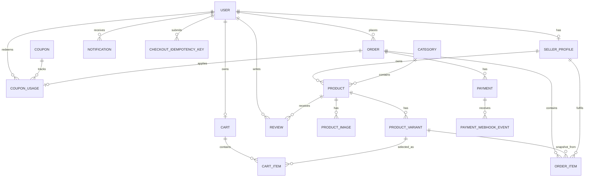
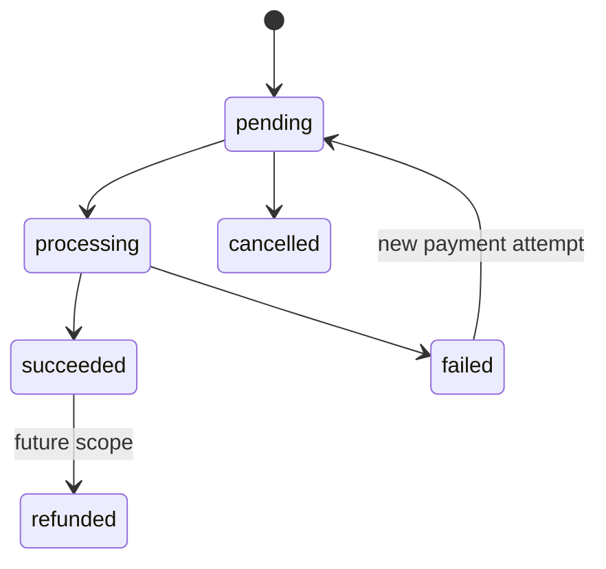
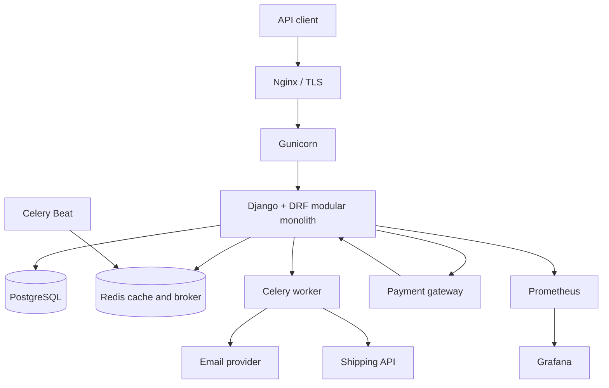

# ShopFlow Step 01: Requirements and Architecture

Status: proposed design for approval before implementation

## 1. Scope and success criteria

ShopFlow is a versioned REST API for a multi-seller e-commerce marketplace. It
is a modular Django monolith: all business capabilities deploy together and
share a PostgreSQL database, but each capability has a clear application and
ownership boundary.

The first release supports customers purchasing active seller products, sellers
maintaining their catalog and fulfilling their own order items, and staff
administering the marketplace. It must preserve correct prices, stock, payment
state, and authorization under normal failures and concurrent checkout.

### Functional requirements

| Area | Requirement |
| --- | --- |
| Accounts | Register, authenticate with JWT, refresh tokens, view/update profile, change/reset password, and log out. |
| Roles | Customer, seller, and admin/staff roles with server-enforced permissions. |
| Catalog | Categories; active products; product images; purchasable variants/SKUs; public list/detail/search/filter/sort/pagination. |
| Seller operations | Sellers manage only their products, variants, images, and stock; view and update fulfillment for their own order items. |
| Cart | One active cart per customer; add, update, remove, clear, and price it server-side. |
| Coupons | Fixed/percentage discounts, dates, order threshold, global and per-user limits, and immutable usage records. |
| Checkout | Validate cart, lock inventory, create an order and price snapshots, consume coupon usage, and create a pending payment atomically. |
| Payment | Create a gateway payment session; accept verified webhooks only; make duplicate webhook delivery harmless. |
| Shipping | Request a shipment from a provider after payment/confirmation and retain tracking data. |
| Reviews | A customer may review a product only after a delivered purchase. |
| Notifications | Persist notifications and deliver email/in-app messages asynchronously. |
| Operations | OpenAPI docs, automated tests, structured logs, health checks, metrics, Docker, CI, backup/restore documentation. |

### Non-functional requirements

| Concern | Requirement |
| --- | --- |
| API contract | All public endpoints use `/api/v1/`, JSON, documented status codes, pagination, and a consistent error shape. |
| Integrity | Checkout uses PostgreSQL transactions and row locks. Order-item prices and product names are snapshots and must never change after purchase. |
| Security | JWT authentication, object-level authorization, environment-managed secrets, HTTPS in production, secure webhook signature validation, rate limiting for sensitive endpoints. |
| Performance | Index declared lookup/filter fields; eliminate N+1 queries; cache safe catalog reads with defined invalidation. |
| Reliability | Background jobs retry bounded transient failures; payment webhooks are idempotent; external calls have timeouts and errors are logged. |
| Observability | Request IDs, structured application logs, readiness/liveness checks, Prometheus metrics, and dashboards. |

### Out of scope for release 1

- Marketplace payouts, commission accounting, tax calculation, returns/refunds, wishlists, multi-currency, guest checkout, and split shipments beyond per-item status.
- A storefront frontend. This project exposes a backend API only.
- Microservices. They add operational complexity without solving a current boundary problem.

## 2. Roles and authorization

| Actor | Allowed actions | Explicit restrictions |
| --- | --- | --- |
| Anonymous | Browse active categories/products; register/login; access public OpenAPI docs. | Cannot access carts, orders, payment initialization, reviews, or administration. |
| Customer | Own profile, cart, checkout, own orders/payments/notifications, eligible reviews. | Cannot modify catalog, other customers' data, seller operations, or admin resources. |
| Seller | Customer abilities plus own seller profile, catalog/variant/image/inventory management, and their order-item fulfillment. | Cannot read another seller's private catalog data or alter another seller's products/order items; cannot change payment state. |
| Admin | Django staff/superuser controlled administration of all domain data and moderation. | Administrative API is separated and should be limited to staff users. |

Role is stored on `User`; `SellerProfile` exists only for seller users. Django's
`is_staff` / `is_superuser` remains the source of administrative access. Role
checks are not a substitute for queryset scoping: every private object endpoint
must scope data to the authenticated owner before lookup.

## 3. Core business rules

### Catalog and inventory

1. A seller owns a product. A product belongs to one category and has zero or more images.
2. A purchasable item is a `ProductVariant` with a globally unique SKU, price, and stock quantity. A product without visible options receives a single default variant created with the product.
3. Products and variants have an active flag. Public catalog endpoints expose only products with active, purchasable variants.
4. Price and stock are validated as non-negative; cart quantity must be a positive integer.
5. Cart additions do not reserve stock. Stock is checked again during checkout while locked.

### Cart and coupons

1. Each customer has at most one active cart; `CartItem` is unique per cart and variant.
2. Adding an existing variant increases or replaces its quantity according to the endpoint contract; the API will use replace semantics for `PATCH` and an explicit add operation for increments.
3. Coupon eligibility is evaluated during checkout, not trusted from the client or a stale cart preview.
4. A coupon must be active, within its date window, satisfy order minimum, and remain under global and per-user usage limits.
5. Coupon usage is created within the same checkout transaction as the order. A cancelled unpaid order releases the usage only when the product decision explicitly permits it; release policy is recorded in the implementation documentation.

### Orders and fulfillment

1. Checkout snapshots each order item's product name, variant description/SKU, unit price, quantity, discount allocation, and line total.
2. An `Order` may contain items owned by several sellers. Therefore the seller-controlled status belongs on `OrderItem`, while the customer-facing `Order.status` is derived/managed centrally.
3. Valid item fulfillment transitions are `pending -> confirmed -> processing -> shipped -> delivered`; cancellation is allowed from `pending`, `confirmed`, or `processing` before shipment. Invalid transitions return `409 Conflict`.
4. An order starts `pending_payment`; it becomes `confirmed` only after a verified successful payment, except for an explicitly supported cash-on-delivery method.
5. Customer cancellation is allowed only while every relevant item is cancellable. Seller cancellation/restocking policy must be handled centrally so a seller cannot affect unrelated items.
6. Delivered items are the sole basis for review eligibility.

### Checkout and concurrency

1. The server recomputes subtotal, discount, shipping, and final amount. Client-supplied totals are ignored.
2. Checkout runs in `transaction.atomic()` and uses `select_for_update()` on all requested variants in a stable primary-key order.
3. After locking, available stock is rechecked. If any variant is insufficient, no order, payment, coupon usage, or stock change is committed.
4. Stock decrement, order creation, item creation, coupon usage, and pending-payment creation commit together.
5. A checkout request carries an idempotency key. Repeating the same key for the same customer returns the original outcome rather than creating another order.

### Payment and external services

1. A client redirect or success message never changes payment state.
2. Payment provider webhooks must pass signature verification and event schema validation before mutation.
3. `PaymentWebhookEvent.provider_event_id` is unique. Processing an already handled event succeeds without repeating side effects.
4. Payment success is the only event that confirms payment/order. Failed or expired payments follow a documented cancellation/release policy.
5. Shipping and email are asynchronous side effects. They use explicit client adapters, finite timeouts, retry only transient failures, and log failures with correlation IDs.

## 4. Data model and ER diagram

All monetary fields are `Decimal` values with a fixed currency selected in environment/application configuration. Every mutable domain model has `created_at` and `updated_at`; high-value transitions also retain actor/time audit fields where needed.



| Entity | Essential fields and constraints |
| --- | --- |
| `User` | email (unique), role, name, password, active flags. Custom Django user model from the first migration. |
| `SellerProfile` | user (one-to-one), store name, contact details, approval/status. User must have seller role. |
| `Category` | name, slug (unique), parent nullable, active flag. |
| `Product` | seller, category, name, slug, description, status. Indexed by seller/category/status. |
| `ProductImage` | product, image location, sort order, alt text. |
| `ProductVariant` | product, SKU (unique), option values, price, stock_quantity, active flag. Indexed by product/active and SKU. |
| `Cart` | customer (one active cart), status. |
| `CartItem` | cart, variant, quantity. Unique `(cart, variant)`. |
| `Coupon` | code (unique), percentage/fixed type, value, minimum amount, maximum discount, start/end, limits, active. |
| `CouponUsage` | coupon, user, order (unique), redeemed amount, redeemed time. Indexed for coupon/user limit queries. |
| `Order` | public order number (unique), customer, status, monetary totals, address snapshot, payment status. |
| `OrderItem` | order, variant reference nullable for retained history, seller, immutable product/SKU snapshots, prices/discount/quantity, fulfillment status, tracking fields. |
| `Payment` | order, provider, provider payment ID (unique per provider), amount/currency, status, initialization data. |
| `PaymentWebhookEvent` | payment nullable until resolved, provider, provider event ID (unique), verified payload metadata, processed timestamp/status. |
| `Review` | customer, product, rating 1-5, body, moderation status. Unique `(customer, product)`. |
| `Notification` | user, type, payload, read timestamp, delivery status. |
| `CheckoutIdempotencyKey` | user, key, request fingerprint, order nullable, response status. Unique `(user, key)`. |

Product references on order items are retained for navigation, but snapshot fields are
the historical source of truth. Product/variant deletion should therefore be soft
deactivation in normal operations.

## 5. Order and payment flows

### Checkout flow

```mermaid
sequenceDiagram
    participant C as Customer
    participant API as Checkout API
    participant DB as PostgreSQL
    participant P as Payment gateway
    C->>API: POST /checkout with idempotency key
    API->>DB: Lock idempotency key and cart variants
    API->>DB: Revalidate product, stock, coupon, and totals
    alt validation succeeds
        API->>DB: Create order/items/payment; decrement stock; record coupon use
        API-->>C: 201 order and payment initialization data
        C->>P: Complete payment
    else validation fails
        API-->>C: 400/409 with no committed order
    end
    P->>API: Signed payment webhook
    API->>DB: Record unique event and verify/update payment
    API->>DB: Mark order paid/confirmed once
    API-->>P: 2xx acknowledgement
```

### Payment state machine



The webhook handler is responsible for authoritative transitions. It must first
persist or lock the event record, then make the transition once, and only then
queue side effects using an after-commit hook.

## 6. API plan

All endpoints are prefixed with `/api/v1/`. List endpoints are paginated and
return documented filter/order parameters. Object identifiers use UUIDs internally
unless an endpoint exposes the public order number or URL slug.

| Group | Main endpoints | Access |
| --- | --- | --- |
| Auth | `POST auth/register`, `POST auth/login`, `POST auth/refresh`, `POST auth/logout`, `GET/PATCH auth/me`, password change/reset endpoints | Public or authenticated as applicable |
| Categories | `GET categories`, `GET categories/{slug}` | Public; admin writes |
| Products | `GET products`, `GET products/{slug}` | Public active catalog |
| Seller catalog | `GET/POST seller/products`, `GET/PATCH/DELETE seller/products/{id}`, nested variants/images/inventory endpoints | Owning seller/admin |
| Cart | `GET cart`, `POST cart/items`, `PATCH/DELETE cart/items/{id}`, `DELETE cart`, `POST cart/coupon-preview` | Customer |
| Checkout/orders | `POST checkout`, `GET orders`, `GET orders/{number}`, `POST orders/{number}/cancel` | Owning customer/admin |
| Seller fulfillment | `GET seller/order-items`, `PATCH seller/order-items/{id}/fulfillment` | Owning seller/admin |
| Coupons | `POST admin/coupons`, `GET/PATCH/DELETE admin/coupons/{id}` | Admin; eligibility is part of checkout |
| Payments | `GET payments/{id}`, `POST payments/{id}/retry`, `POST payments/webhooks/{provider}` | Owner for read/retry; provider webhook is signature-authenticated |
| Reviews | `GET products/{slug}/reviews`, `POST products/{slug}/reviews`, `PATCH/DELETE reviews/{id}` | Public read; eligible owner writes; admin moderation |
| Notifications | `GET notifications`, `POST notifications/{id}/read` | Owning user |
| Operations | `GET health/live`, `GET health/ready`, `GET metrics`, `GET docs/` | Infrastructure/public docs according to environment |

Response conventions:

- `201` for creation, `204` for successful no-body deletion, `400` for malformed or business validation, `401` for unauthenticated, `403` for forbidden, `404` for absent/non-visible resources, `409` for state or stock conflicts, `429` for limits.
- Errors use a consistent object: `{"code": "insufficient_stock", "message": "...", "details": {...}, "request_id": "..."}`.
- Write operations that can be retried by clients, especially checkout, use `Idempotency-Key` request headers.

## 7. Architecture



### Boundary rules

- Views/serializers translate HTTP and validate request shape. They do not contain checkout, payment, or stock business workflows.
- Services/use cases own transactions and cross-application workflows: checkout, payment event processing, stock adjustments, coupon validation, and fulfillment transitions.
- Repositories are not added as a blanket abstraction over Django ORM. Querysets/managers live near their domain models; dedicated query services are added only for complex read paths.
- Provider integrations sit behind small adapter interfaces so providers can be exchanged/tested with fakes.
- Celery tasks call idempotent service methods. A task retry must be safe.

## 8. Proposed folder and module structure

```text
shopflow/
├── config/                 # settings, ASGI/WSGI, URLs, Celery app
│   └── settings/           # base.py, development.py, staging.py, production.py
├── apps/
│   ├── common/             # base models, exceptions, request IDs, shared utilities
│   ├── accounts/           # User, SellerProfile, auth and permissions
│   ├── catalog/            # categories, products, variants, images, catalogue reads
│   ├── cart/               # carts and cart items
│   ├── orders/             # checkout, orders, order items, fulfillment
│   ├── coupons/            # coupon validation and usage
│   ├── payments/           # payments, gateway adapters, verified webhook handling
│   ├── shipping/           # shipping provider adapter and tracking
│   ├── reviews/            # purchase-eligible reviews and moderation
│   └── notifications/      # notification persistence and delivery tasks
├── tests/                  # integration/API tests and shared factories
├── docs/                   # architecture, operations, runbooks
├── docker/                 # Nginx and container configuration
├── compose.yaml
├── Dockerfile
├── pyproject.toml
└── manage.py
```

Within a substantial app, use `models.py`, `serializers.py`, `views.py`,
`urls.py`, `permissions.py`, `services.py`, `selectors.py`, `tasks.py`,
`admin.py`, `migrations/`, and `tests/` as needed. Do not create empty files or
layers before they serve a concrete workflow.

## 9. Step 01 acceptance checklist

- [x] Scope, non-goals, and first-release success criteria are defined.
- [x] Customer, seller, admin, and anonymous permissions are bounded.
- [x] Domain entities, ownership, key constraints, and retention rules are defined.
- [x] SKU-level inventory and multi-seller fulfillment decisions are recorded.
- [x] Checkout locking, idempotency, and rollback behavior are specified.
- [x] Payment webhook verification and duplicate-delivery behavior are specified.
- [x] API groups, versioning, status/error conventions, and authorization are planned.
- [x] Deployment architecture and module layout are defined.

## 10. Decisions required before Phase 2

The following are deliberately provider/product decisions, not implementation
details. Choose and record them before the relevant later phase:

1. Payment provider and supported payment methods, including webhook signing algorithm and sandbox credentials.
2. Shipping provider, destination countries, shipping-rate calculation, and address fields.
3. Default currency, timezone, tax policy, and whether shipping is a flat fee or provider-calculated.
4. Exact policy for cancellation, payment expiry, failed payment stock release, coupon release, and refunds.
5. Whether sellers self-register pending approval or can only be created/approved by an admin.

Phase 2 may begin once these structural decisions are accepted. Payment and
shipping provider choices may be postponed until Phase 6, but the selected
interfaces and state rules above must remain stable.
